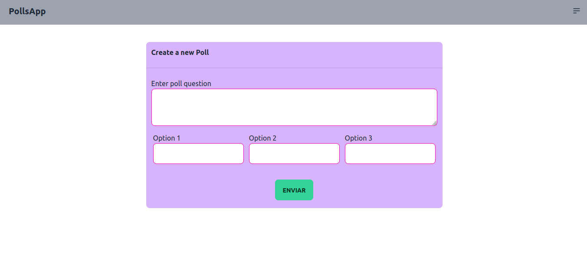
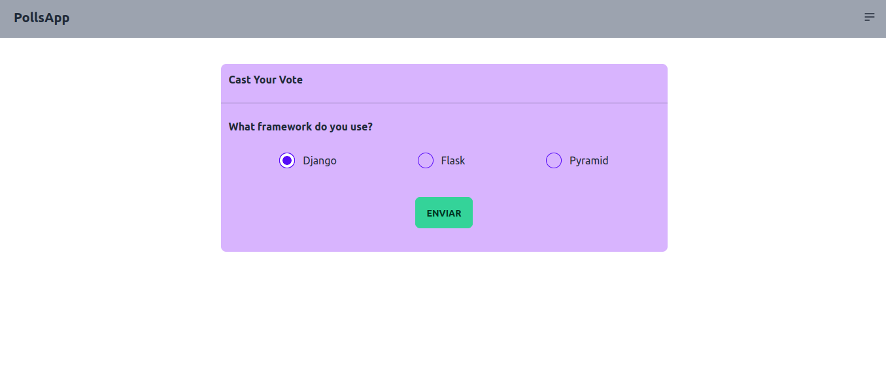
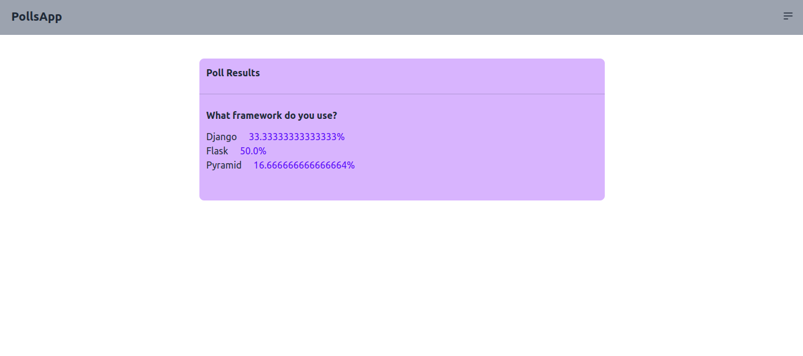

<h1>✍️Poll App✍️</h1>

Poll app using Django

<h1>Construido con 🔧</h1>

<ul>
    <li>Django</li>
    <li>Tailwind Css</li>
    <li>Daisy UI</li>
</ul>

<h1>Autores ✒️</h1>

<ul>
    <li>María José Alba</li>
</ul>

